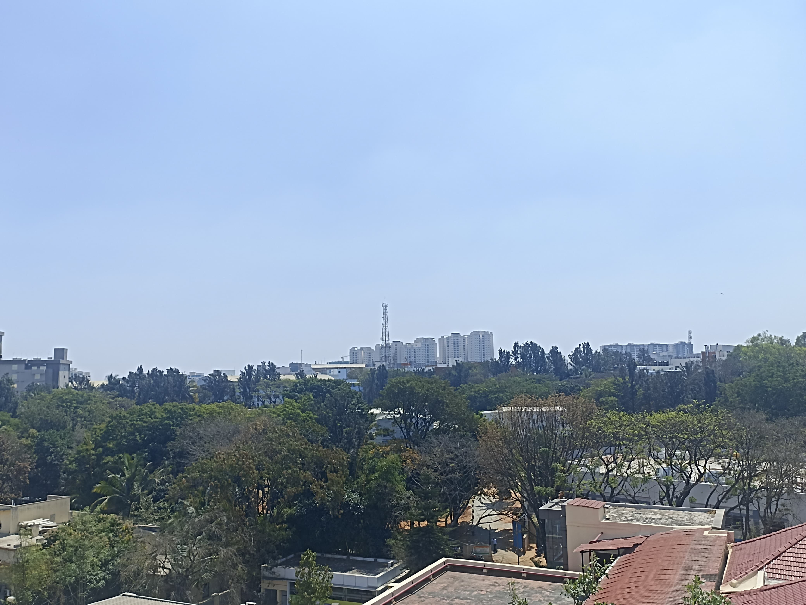

# Visual-Recognition-Assignment_1
Using OpenCV for image detection, segmentation and stitching.

## Installation and Running Instructions
### Step 1: Install Miniconda and Create a Conda Environment
1. First, install [Miniconda](https://docs.conda.io/en/latest/miniconda.html) if it is not already installed.

2. Create a new conda environment by running the following command in the terminal:
   ```bash
   conda create -n myenv python=3.12
   
3. Activate conda environment:
   ```bash
   conda activate myenv

### Step 2: Installing Dependencies
With the environment activated, install the required dependencies for the project:
      ```bash
      conda install -c conda-forge opencv numpy matplotlib
      
### Step 3: Add Input Images
1. Place the input image containing scattered Indian coins in the `images/` folder.
2. The image should be named `coins.jpg` as specified in the code.
3. Also add the 3 images to be stitched in the 'images/' folder, following the same naming convention as given.

### Step 4: Running the Code
1. After ensuring the images are in the correct path and the dependencies are installed, navigate to the project directory in the terminal.
2. Select the conda environment in which you installed the dependencies.
3. Run the code for Part 1 by executing the following command:
   ```bash
   python part_1.py
4. Run the code for Part 2 by executing the following command:
   ```bash
   python part_2.py

## Part 1: Coin Detection, Segmentation, and Counting using Computer Vision

### Overview
This section applies computer vision techniques to detect, segment, and count coins from an image containing scattered Indian coins. The implementation is done using **OpenCV** and **Matplotlib** in a Miniconda environment.

---

### Input Image:


### Methodology

#### **1. Detecting Coins (Edge Detection)**
   - The input image is first converted to grayscale for easier processing.
   - A **Gaussian Blur** is applied to reduce noise.
   - **Adaptive Thresholding** is used to separate coins from the background.
   - **Contour Detection** is performed using `cv2.findContours()`, and only significant contours (based on area) are retained.
   - The detected coins are outlined using `cv2.drawContours()`. 

#### **2. Segmenting Individual Coins**
   - The image undergoes further **thresholding** and **contour extraction**.
   - Coins are **isolated** using **bounding boxes** around each detected contour.
   - Contours nested within others (e.g., inner rings of ₹10 coins) are filtered out to avoid misclassification.
   - The segmented coins are **cropped and displayed** separately.

#### **3. Counting Coins**
   - The number of final valid contours from segmentation represents the **total number of coins**.
   - A **text overlay** displaying the count is added to the final processed image.
   - The processed image is displayed, highlighting each detected coin.

---

### Results

1. **Detection & Outlining:**  
   - Coins in the image are successfully detected and highlighted with contours.
     
   
2. **Segmentation:**  
   - Each coin is **accurately isolated** with minimal noise.
   - Filtering out nested contours helps avoid incorrect segmentation.
     

3. **Counting:**  
   - The program correctly counts the number of coins in the image.
   - The count is displayed on the processed image.
     

---

### Observations

- **Gaussian Blur** significantly improves edge detection by reducing background noise.
- **Adaptive Thresholding** works well for separating coins from the background, regardless of lighting variations.
- **Filtering out smaller contours** ensures that noise and unwanted objects are ignored.
- **Contour area-based filtering** helps in excluding unnecessary details like inner rings of some coins.
- **Bounding box segmentation** allows accurate cropping and display of individual coins.


## Part 2: Creating a Stitched Panorama from Multiple Overlapping Images  

---


### Input Images:




### Methodology  

#### 1. Keypoint Detection  
We used the **ORB (Oriented FAST and Rotated BRIEF)** feature detector to identify key points in each of the overlapping images. ORB is a fast and efficient method that is invariant to rotation and scale, making it suitable for feature detection in image stitching.  

#### 2. Feature Matching  
The **Brute-Force Matcher (BFMatcher)** with the Hamming distance metric was used to match key points between consecutive images. Only the best-matching key points were considered to ensure high accuracy.  

#### 3. Homography Transformation  
A **homography matrix** was computed using **RANSAC (Random Sample Consensus)** to align the images based on matched key points. This transformation ensures proper perspective warping and alignment.  

#### 4. Image Warping and Stitching  
Each image was warped using **perspective transformation**, aligning it to the previous image in the sequence. The images were then combined to form a seamless panorama.  

#### 5. Cropping  
To remove black regions introduced by warping, a **bounding box detection** technique was applied, ensuring the final panorama had no unnecessary black spaces.  

---

### Results  

#### Detected Key Points in Individual Images  
Each image was processed using ORB, and the detected key points were visualized. 


**Key Points Visualization:**  
  

#### Final Stitched Panorama  
The stitched image, obtained after key point detection, feature matching, homography transformation, and warping.  

**Final Panorama Output:**  
  

---

### Observations  

- The ORB detector provided a good balance between speed and accuracy for keypoint detection.  
- The BFMatcher successfully matched key points between overlapping images, allowing for effective image alignment.  
- The RANSAC-based homography estimation removed outlier matches, improving the stitching quality.  
- Some distortions were observed at the image edges due to perspective warping.  
- Black regions were successfully cropped out to improve the final output.  


